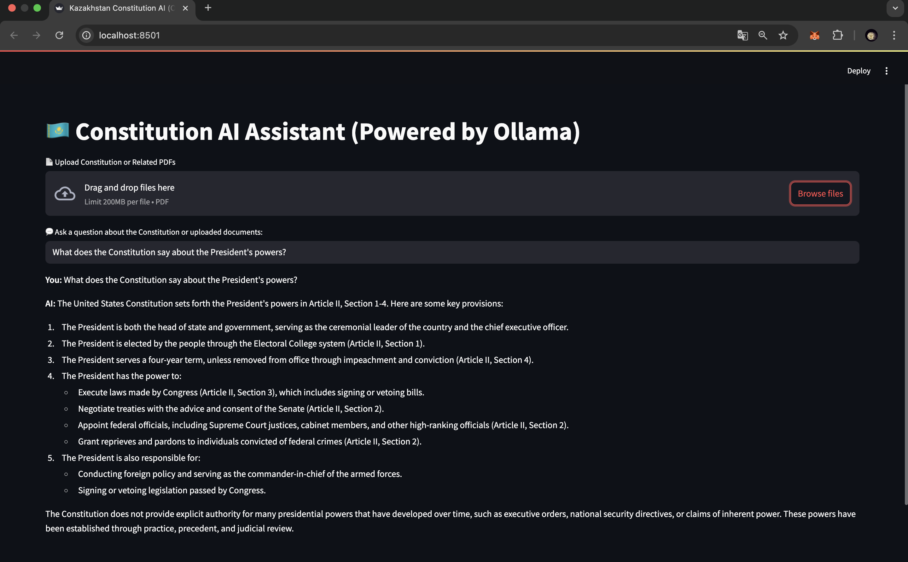
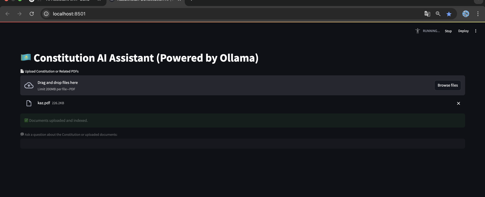
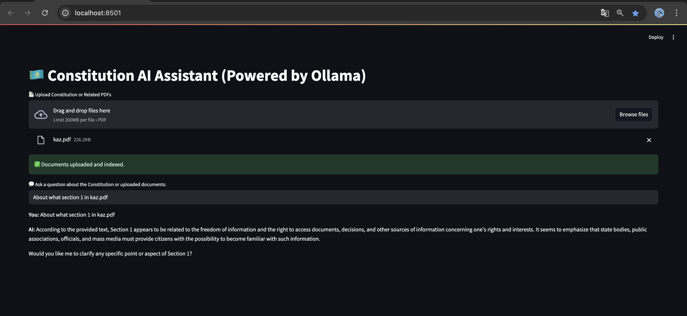

## 🚀 Getting Started

### ✅ Prerequisites

- macOS with **Homebrew**
- Python 3.9+
- [Ollama](https://ollama.com) installed

---

### 📦 Step-by-Step Installation

#### 1. Install Ollama + Models

```bash
brew install ollama

ollama pull llama3
ollama pull nomic-embed-text

---

# 🇰🇿 Kazakhstan Constitution AI Assistant (Local LLM with Ollama)

An AI-powered assistant that can **answer questions about the Constitution of the Republic of Kazakhstan** using uploaded PDF documents. This app uses **open-source, local language models** (like LLaMA3 via Ollama) and runs entirely **offline** on your Mac.

---

## 📸 Screenshots

> _Add your screenshots into a `/screenshots` folder and update paths below._

### ❓ Ask Questions


### 📥 Upload PDFs


### ❓ Ask Questions regarding uploaded pdf


---

## ✨ Features

- 🧠 Powered by local Large Language Models (e.g., `llama3`, `mistral`, etc.)
- 🗂 Upload multiple PDF documents (e.g., Constitution, laws, references)
- 🤖 Ask natural language questions about the content
- 🔍 Retrieves relevant text chunks using vector similarity
- 💬 Conversational memory (retains chat history)
- 💾 Stores embeddings in persistent ChromaDB
- 🌐 Simple and clean Streamlit-based UI

---

## 🛠 Technologies Used

| Component         | Tool                            |
|------------------|---------------------------------|
| LLM              | [`Ollama`](https://ollama.com)  |
| Embeddings       | `nomic-embed-text` (Ollama)     |
| Retrieval        | `ChromaDB`                      |
| UI               | `Streamlit`                     |
| Document Parsing | `LangChain` + `PyPDFLoader`     |

---

## 🚀 Getting Started

### ✅ Prerequisites

- macOS with **Homebrew**
- Python 3.9+
- [Ollama](https://ollama.com) installed

---

### 📦 Step-by-Step Installation

#### 1. Install Ollama + Models

```bash
brew install ollama

ollama pull llama3
ollama pull nomic-embed-text
````

#### 2. Clone This Repository

```bash
git clone https://github.com/gemdivk/kazakhstan-ai-assistant.git
cd kazakhstan-ai-assistant
```

#### 3. Set Up Python Environment

```bash
python3 -m venv venv
source venv/bin/activate
pip install -r requirements.txt
```

#### 4. Start Ollama Server (in a separate terminal)

```bash
ollama serve
```

#### 5. Launch the Streamlit App

```bash
streamlit run app.py
```

---

## 🧪 How to Use

1. Go to [http://localhost:8501](http://localhost:8501)
2. Upload one or more **PDF files** (Constitution, legal docs, etc.)
3. Wait for: ✅ `Documents uploaded and indexed.`
4. Enter a question like:

> ❓ *What is the official language of Kazakhstan?*

> 🧠 *AI will search your documents and respond contextually.*

---

## 📁 Project Structure

```
kazakhstan-ai-assistant/
├── app.py                # Main Streamlit app
├── requirements.txt      # Python dependencies
├── chroma_db/            # Vector DB (auto-created)
├── screenshots/          # Screenshots for README
└── README.md             # Project documentation
```

---

## 💡 Tips

* Use smaller models like `mistral` for faster results.
* Use `nomic-embed-text` for much faster embeddings than LLMs like `llama3`.
* All processing happens **locally** – no API keys or internet needed.
* Indexing large PDFs may take time. Add spinner for better UX.

---

## 📜 License

MIT License — free for academic, personal, or commercial use.

---

## 🙋‍♂️ Author

Built by \Kamila Kanafina SE-2324, Abdyhalyk Dias SE-2322 — powered by 💻 LangChain, 🧠 Ollama, and 🇰🇿 Kazakhstan’s Constitution.

````
# vectorhash
