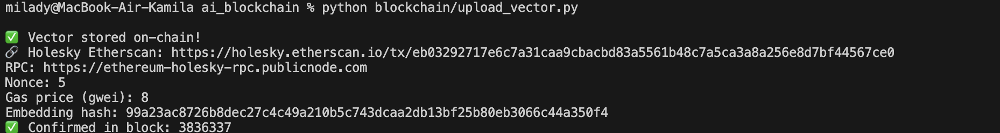
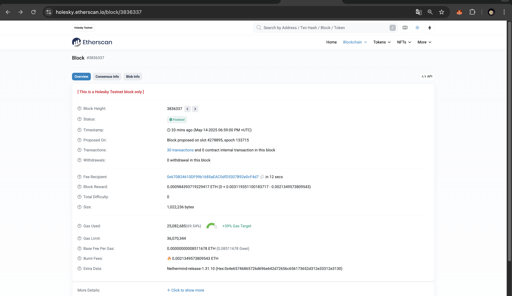
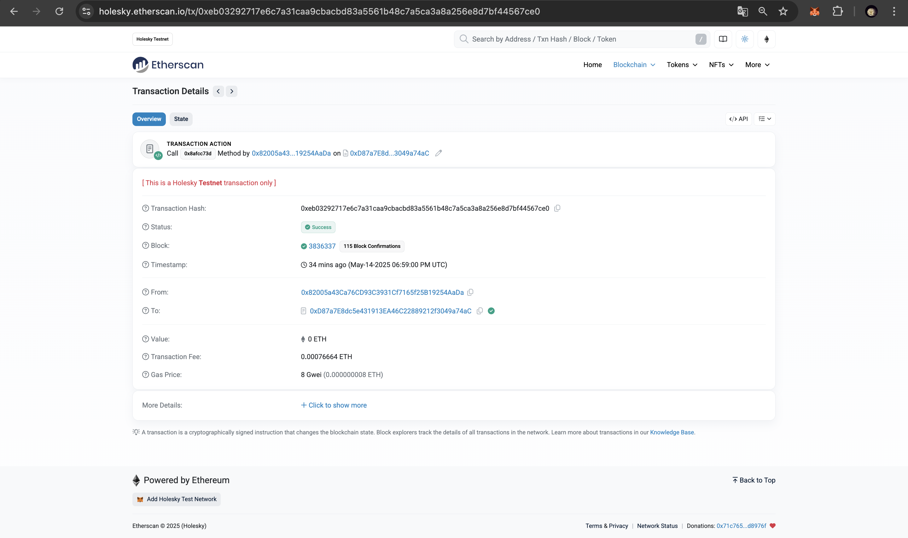

# 🇰🇿 On-Chain Knowledge Base for Kazakhstan’s Constitution AI Assistant

This project extends a Constitution QA assistant using LangChain and Ollama by storing semantic vector hashes on the **Ethereum Holesky testnet** using a **Solidity smart contract**.

---

## 🧠 Project Overview

| Feature | Description |
|--------|-------------|
| LLM Assistant | Answers questions about the Constitution using RAG |
| Vector DB | ChromaDB (off-chain embeddings) |
| Blockchain | Ethereum (Holesky testnet) |
| On-chain storage | Hashed vectors using keccak256 stored via Solidity |

---

## 🛠 Tech Stack

- Python
- Streamlit (chat interface)
- LangChain + Ollama (`llama3`, `nomic-embed-text`)
- Solidity smart contract (deployed on Holesky)
- `web3.py` for blockchain interaction

---

## ⚙️ How It Works

1. User uploads Constitution PDFs
2. Assistant splits and embeds text into vectors
3. Vectors are stored locally in ChromaDB
4. Each embedding is hashed (keccak256) for compactness
5. The hash + document title are stored on-chain

---

## 📦 Smart Contract

**`blockchain/ConstitutionVectors.sol`**

```solidity
function storeVector(string memory docTitle, bytes32 embeddingHash) public;
function getVector(uint id) public view returns (string memory, bytes32);
````

---

## 🔗 Transaction Details

| Info             | Value                                                                                                                 |
| ---------------- | --------------------------------------------------------------------------------------------------------------------- |
| Chain            | Holesky Testnet (chainId: 17000)                                                                                      |
| Contract Address | `0xb7b8C3D04150f9A53262c35Cc98afA6315C7b975`                                                                          |
| TX Hash          | [`0xeb03...7ce0`](https://holesky.etherscan.io/tx/0xeb03292717e6c7a31caa9cbacbd83a5561b48c7a5ca3a8a256e8d7bf44567ce0) |
| Block            | [`#3836337`](https://holesky.etherscan.io/block/3836337)                                                              |

---

## 💾 Sample Python Script

This script:

* Loads `.env` config
* Builds and signs a TX to `storeVector()`
* Prints transaction and block info

---

## 🖼 Screenshots (Proof)

These should be placed inside: `screenshots/`

| Screenshot         | Path                                 | Description                                         |
| ------------------ | ------------------------------------ | --------------------------------------------------- |
| ✅ Terminal log     | | Shows full TX hash, hash value, block number        |
| ✅ Block details    |       | Screenshot of block `#3836337` on Holesky Etherscan |
| ✅ Transaction page |    | Transaction detail from Etherscan (confirmed TX)    |

---

## ✅ Submission Checklist

* [x] Deployed Solidity smart contract
* [x] Embedded Constitution text
* [x] Stored vector hash on Holesky
* [x] Proof via terminal and blockchain explorer
* [x] `.env` (NOT pushed — safe example included)

---

## 🧪 Example `.env` (DO NOT push real keys)

```env
PRIVATE_KEY=0xYOUR_TEST_PRIVATE_KEY
WALLET_ADDRESS=0xYOUR_WALLET
HOLESKY_RPC=https://ethereum-holesky-rpc.publicnode.com
CONTRACT_ADDRESS=0xYOUR_CONTRACT_ADDRESS
```

---

## 🐈‍⬛ Author

* Name: Kamila Kanafina SE-2324
* Project: Blockchain AI Assistant for Kazakhstan’s Constitution
* University: Astana IT University

